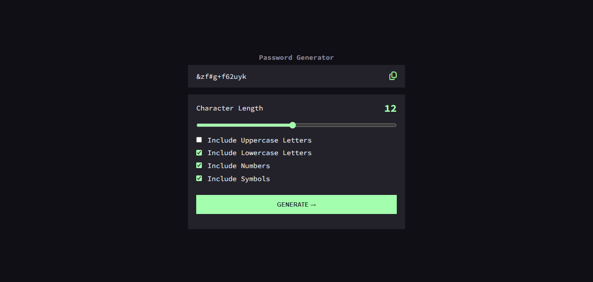

# Password Generator

## Overview

This is a simple web application that generates random passwords based on user-specified criteria. It allows users to customize the length and character types (e.g., uppercase letters, lowercase letters, numbers, special characters) of the generated password.

## Features

- <b>Customizable Password Generation:</b> Users can specify the length of the password and select which character types to include.

- <b>Copy to Clipboard</b>: Generated passwords can be easily copied to the clipboard with the click of a button.

- <b>Responsive Design:</b> The application is designed to work seamlessly across various devices, including desktops, tablets, and smartphones.

- <b>Simple and Intuitive Interface</b>: The user interface is clean and user-friendly, making it easy for users to generate passwords quickly.

## Technologies Used

## Contributing

Contributions are welcome! If you find any bugs, have feature requests, or would like to contribute to the project, please open an issue or submit a pull request on the GitHub repository.
